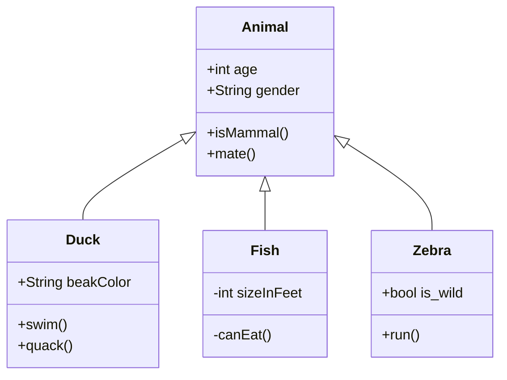

- 👋 Hi, I’m @skmuiruri
- 👀 I’m interested in distributed systems and FP
- 🌱 I’m currently learning ZIO
- 💞️ I’m looking to collaborate on ZIO related projects
- 📫 How to reach me @SamsonKamauM

<!---
skmuiruri/skmuiruri is a ✨ special ✨ repository because its `README.md` (this file) appears on your GitHub profile.
You can click the Preview link to take a look at your changes.
--->

